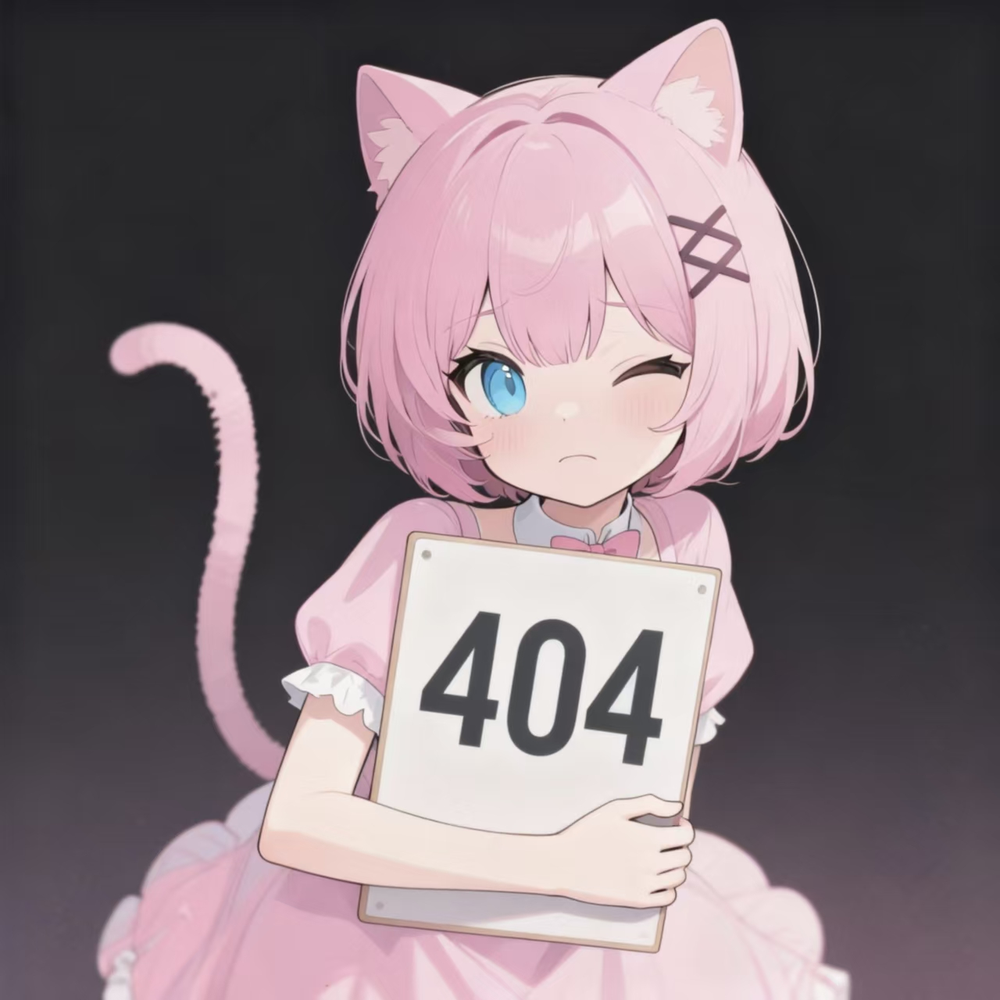

# 项目版权声明文档

**版本**： 1.0
**最后更新**： 2025-12-01
**维护者**： fumimutsumi

---

## 通用声明

1.  本项目是维护者 **fumimutsumi** 的**个人学习与交流项目**，所有内容均用于技术实践、样式展示等非商业目的，不涉及任何盈利行为。
2.  项目中使用的第三方内容（如图片、文案）均已尽力标注来源。若您认为任何内容侵犯了您的合法权益，请通过 **[15175969957@163.com](mailto:15175969957@163.com)** 与我联系，我将在核实后第一时间进行处理。
3.  未经本人明确许可，**禁止**将本项目的任何部分用于商业、盈利或其他非法用途。

---

## 图片素材版权说明

### 1. 原创图片
*   **内容**：由本人独立创作或拥有的图片素材（如网站吉祥物）。
*   **示例**：`"assets/images/"和"docs/images/"等中的所有"hoshina"`
*   
*   **声明**：此部分图片的著作权归本人（fumimutsumi）所有。**任何商业性使用均需获得我的事先许可**；非商业性的学习、参考和分享则不受此限。

### 2. 免费授权图片
*   **来源**：来自明确提供免费商用许可的公共资源平台（如 Unsplash, Pexels 等）。
*   **声明**：这些图片遵循其原平台的许可协议。本项目在使用时已遵守相应规定（如必要的署名要求），您也可依据原协议规定使用它们。

### 3. 官方版权图片
*   **来源**：源自《明日方舟》、《鸣潮》等游戏的官方素材。
*   **涉及版权方**：
    *   《明日方舟》 - Hypergryph / 鹰角网络
    *   《鸣潮》 - Kuro Games / 库洛游戏
*   **声明**：此部分所有内容的著作权均归属于上述官方版权方。本项目仅为个人学习目的进行非商业性引用，**未获得官方正式授权**。严禁任何商业用途或侵害版权方权益的行为。
*   **官方链接**：
    *   [明日方舟版权声明页面](https://user.hypergryph.com/protocol/ak/service)
    *   [鸣潮版权声明页面](https://sdk.kurogames.com/p/agreement_public.html)

### 4. 二次创作作品
*   **来源**：由其他创作者基于官方作品衍生的二次创作（二创）图片。
*   **权利方**：
    *   **作品著作权**：归属原画师。
    *   **原作元素著作权**：归属对应的游戏官方版权方。
*   **声明**：本项目的使用已获得画师授权，或为个人学习性质的合理使用。**严禁**将此部分内容用于任何商业目的。若您是相关权利人并对展示有异议，请联系我进行移除。
*   **画师信息表**（请根据实际情况填写和增减行）：

| 作品名称 | 画师昵称 | 平台/ID | 授权状态 |
| :--- | :--- | :--- | :--- |
| 鸣潮-朽叶千咲同人插画:chisaki-matcha.jpg | Matcha | Pixiv-id:2583663 | 个人学习引用，如有异议请联系删除 |

---

## 文案与设定版权说明

*   **涉及内容**：项目中引用的《明日方舟》、《鸣潮》等游戏的角色设定、世界观描述、剧情文本等。
*   **版权声明**：所有相关文案、设定的著作权均归属于其各自的官方版权方（鹰角网络、库洛游戏等）。本项目仅为学习交流目的进行非商业性引用，**未获得官方正式授权**。任何组织或个人不得将其用于商业目的。

---

> **重要提示**：本声明文档将随着项目内容的更新而持续修订。您对项目的访问和使用即视为理解并同意本声明的所有条款。