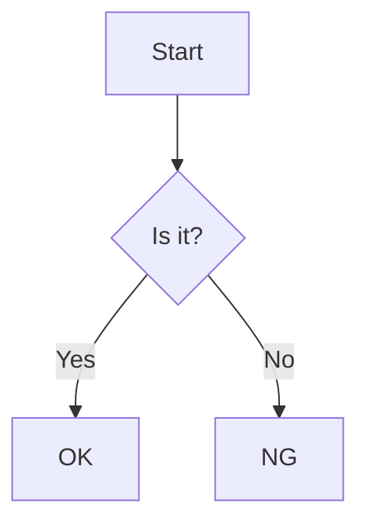

# Markdown语法完全指南

Markdown是一种轻量级的标记语言，允许人们使用简单易读的纯文本格式编写文档，然后转换成格式丰富的HTML页面。它被广泛应用于GitHub、博客平台、文档系统等场景。本指南将详细介绍Markdown的所有常用语法，并提供实用示例。

## 一、标题

Markdown支持6级标题，使用`#`符号表示，`#`的数量代表标题级别。

```markdown
# 一级标题
## 二级标题
### 三级标题
#### 四级标题
##### 五级标题
###### 六级标题
```

**显示效果**：
# 一级标题
## 二级标题
### 三级标题
#### 四级标题
##### 五级标题
###### 六级标题

**注意事项**：`#`和标题文本之间最好保留一个空格，这是标准写法，虽然有些解析器不要求，但为了兼容性最好加上。

## 二、段落与换行

### 2.1 段落

在Markdown中，一个段落就是一段连续的文本，前后需要空一行。不需要缩进，缩进在Markdown中通常没有特殊含义（除非是代码块）。

```markdown
这是第一个段落。这是一个普通的Markdown段落，不需要任何特殊的格式标记。

这是第二个段落。注意两个段落之间需要有一个空行分隔。
```

### 2.2 换行

如果需要在段落内换行（而不是开始一个新段落），需要在行尾添加两个或更多空格，然后按回车键。

```markdown
这是第一行末尾添加了两个空格  
这是第二行，会另起一行显示

这是新的段落，因为上面有一个空行
```

**常见问题**：有些编辑器支持直接按回车换行，但这不是标准的Markdown语法，为了确保在所有平台上的兼容性，最好使用行尾加两个空格的方法。

## 三、强调

### 3.1 斜体

使用`*`或`_`包裹文本可以创建斜体效果。

```markdown
*这段文本是斜体* 或者 _这段文本也是斜体_
```

**显示效果**：
*这段文本是斜体* 或者 _这段文本也是斜体_

### 3.2 粗体

使用`**`或`__`包裹文本可以创建粗体效果。

```markdown
**这段文本是粗体** 或者 __这段文本也是粗体__
```

**显示效果**：
**这段文本是粗体** 或者 __这段文本也是粗体__

### 3.3 粗斜体

使用`***`或`___`包裹文本可以创建粗斜体效果。

```markdown
***这段文本是粗斜体*** 或者 ___这段文本也是粗斜体___
```

**显示效果**：
***这段文本是粗斜体*** 或者 ___这段文本也是粗斜体___

## 四、列表

### 4.1 无序列表

无序列表使用`*`、`+`或`-`作为列表标记，后面跟一个空格和列表项内容。

```markdown
* 列表项1
* 列表项2
* 列表项3

+ 另一种无序列表方式
+ 列表项2

- 还有一种无序列表方式
- 列表项2
```

**显示效果**：
* 列表项1
* 列表项2
* 列表项3

**注意**：这三种标记（`*`、`+`、`-`）在功能上是完全相同的，可以根据个人喜好选择使用。

### 4.2 有序列表

有序列表使用数字加`.`作为列表标记，后面跟一个空格和列表项内容。

```markdown
1. 第一项
2. 第二项
3. 第三项
```

**显示效果**：
1. 第一项
2. 第二项
3. 第三项

**小技巧**：有序列表的数字实际上不会影响输出结果的编号，Markdown会自动按顺序编号。例如，即使你写成`1. 第一项 3. 第二项 2. 第三项`，最终显示出来的仍然是1、2、3的顺序。

### 4.3 嵌套列表

列表可以嵌套，只需要在子列表项前添加缩进（通常是4个空格或1个制表符）。

```markdown
1. 第一项
    * 子列表项1
    * 子列表项2
2. 第二项
    1. 子列表项1
    2. 子列表项2
```

**显示效果**：
1. 第一项
    * 子列表项1
    * 子列表项2
2. 第二项
    1. 子列表项1
    2. 子列表项2

## 五、链接

### 5.1 行内链接

行内链接的基本格式是`[链接文本](链接地址 "可选的标题")`。

```markdown
这是一个[百度](https://www.baidu.com)的链接。
这是一个带有标题的[GitHub](https://github.com "GitHub官网")链接。
```

**显示效果**：
这是一个[百度](https://www.baidu.com)的链接。
这是一个带有标题的[GitHub](https://github.com "GitHub官网")链接。

**注意**：标题部分是可选的，当鼠标悬停在链接上时会显示这个标题。

### 5.2 引用链接

引用链接允许你在文档末尾定义链接，然后在正文中引用它们，适合在文档中多次使用同一链接的情况。

```markdown
这是一个[百度][1]的链接，这也是一个[百度][1]的链接。

[1]: https://www.baidu.com "百度官网"
```

**显示效果**：
这是一个[百度][1]的链接，这也是一个[百度][1]的链接。

[1]: https://www.baidu.com "百度官网"

### 5.3 自动链接

对于简单的URL或电子邮件地址，可以用尖括号包裹，Markdown会自动将其转换为链接。

```markdown
<https://www.baidu.com>
<example@example.com>
```

**显示效果**：
<https://www.baidu.com>
<example@example.com>

## 六、图片

图片的语法与链接类似，只是在前面多了一个感叹号`!`。基本格式是``。

```markdown


<!-- 引用式图片 -->
![GitHub Logo][logo]

[logo]: https://github.githubassets.com/images/modules/logos_page/GitHub-Mark.png "GitHub的Logo"
```

**注意**：替代文本是当图片无法显示时显示的文本，对可访问性很重要。标题部分同样是鼠标悬停时显示的文本。

## 七、代码

### 7.1 行内代码

使用反引号`` ` ``包裹代码片段可以创建行内代码。

```markdown
在HTML中，我们使用`<div>`标签来创建一个区块。
```

**显示效果**：
在HTML中，我们使用`<div>`标签来创建一个区块。

### 7.2 代码块

有两种方式创建代码块：

1. 缩进4个空格或1个制表符（适合在列表中嵌入代码块）

```markdown
普通文本
    这是一个代码块
    可以有多行
普通文本
```

2. 使用三个反引号`` ``` ``包裹代码块，可以指定语言以启用语法高亮

````markdown
```python
def hello_world():
    print("Hello, Markdown!")
```
````

**显示效果**：
```python
def hello_world():
    print("Hello, Markdown!")
```

**注意**：指定语言时，语言名称要小写，且不要有空格。常见的语言包括`python`、`javascript`、`html`、`css`、`java`等。

## 八、引用

### 8.1 基本引用

使用`>`符号可以创建引用块。

```markdown
> 这是一段引用内容。
> 引用可以有多行。
```

**显示效果**：
> 这是一段引用内容。
> 引用可以有多行。

### 8.2 嵌套引用

引用可以嵌套，只需要在嵌套的引用前添加多个`>`符号。

```markdown
> 这是外层引用
>> 这是内层引用
>>> 这是更深层的引用
```

**显示效果**：
> 这是外层引用
>> 这是内层引用
>>> 这是更深层的引用

### 8.3 引用中包含其他元素

引用中可以包含Markdown的其他元素，如标题、列表、代码块等。

```markdown
> ### 引用中的标题
>
> * 引用中的列表项1
> * 引用中的列表项2
>
> ```
> 引用中的代码块
> ```
```

**显示效果**：
> ### 引用中的标题
>
> * 引用中的列表项1
> * 引用中的列表项2
>
> ```
> 引用中的代码块
> ```

## 九、表格

使用`|`和`-`可以创建表格。`-`用于分隔表头和表格体，`:`可以用来指定对齐方式。

```markdown
| 姓名 | 年龄 | 职业 |
|------|------|------|
| 张三 | 25   | 工程师 |
| 李四 | 30   | 设计师 |
| 王五 | 28   | 产品经理 |

<!-- 指定对齐方式 -->
| 左对齐 | 居中对齐 | 右对齐 |
|:-------|:--------:|-------:|
| 内容 | 内容 | 内容 |
| 长文本内容 | 长文本内容 | 长文本内容 |
```

**显示效果**：
| 姓名 | 年龄 | 职业 |
|------|------|------|
| 张三 | 25   | 工程师 |
| 李四 | 30   | 设计师 |
| 王五 | 28   | 产品经理 |

**注意**：
- 表格的每一行必须有相同数量的单元格
- 表头行和内容行之间的分隔线不能省略
- 对齐方式的冒号必须放在分隔线的相应位置

## 十、分隔线

使用三个或更多的`*`、`-`或`_`可以创建分隔线，它们之间可以有空格。

```markdown
这是上面的内容

***

这是中间的内容

---

这是下面的内容

___
```

**显示效果**：
这是上面的内容

***

这是中间的内容

---

这是下面的内容

___

**注意**：为了避免被解析为标题，使用`-`创建分隔线时，前后最好要有空行，或者确保上一行不是以`-`开头的文本。

## 十一、转义字符

使用反斜杠`\`可以转义Markdown中的特殊字符，使它们显示为普通字符。

```markdown
\* 这不是斜体文本，因为星号被转义了 \
\` 这不是代码，因为反引号被转义了 \
\# 这不是标题，因为井号被转义了 \
\[ 这不是链接的开始 \
\] 这不是链接的结束 \
\( 这不是链接地址的开始 \
\) 这不是链接地址的结束
```

**显示效果**：
\* 这不是斜体文本，因为星号被转义了 \
\` 这不是代码，因为反引号被转义了 \
\# 这不是标题，因为井号被转义了 \
\[ 这不是链接的开始 \
\] 这不是链接的结束 \
\( 这不是链接地址的开始 \
\) 这不是链接地址的结束

**常见转义字符**：`\` `*` `_` `{` `}` `[` `]` `(` `)` `#` `+` `-` `.` `!` `|` `` ` ``

## 十二、任务列表

任务列表是一种特殊的列表，允许你创建可勾选的项目。使用`- [ ]`表示未勾选，`- [x]`表示已勾选。

```markdown
- [x] 完成Markdown基础语法学习
- [ ] 练习创建表格
- [ ] 学习高级Markdown功能
```

**显示效果**：
- [x] 完成Markdown基础语法学习
- [ ] 练习创建表格
- [ ] 学习高级Markdown功能

**注意**：任务列表在GitHub等平台上支持良好，但在某些Markdown编辑器中可能不被支持。

## 十三、脚注

脚注允许你在文档中添加注释或引用，而不会干扰正文的阅读。使用`[^标识符]`在正文中标记脚注，然后在文档末尾定义脚注内容。

```markdown
这是一个带有脚注的句子。[^1]

[^1]: 这是脚注的内容，可以包含详细的解释或引用来源。
```

**显示效果**：
这是一个带有脚注的句子。[^1]

[^1]: 这是脚注的内容，可以包含详细的解释或引用来源。

## 十四、删除线

使用`~~`包裹文本可以创建删除线效果。

```markdown
~~这段文本被删除了~~
```

**显示效果**：
~~这段文本被删除了~~

## 十五、Markdown的高级功能

### 15.1 HTML标签

在Markdown中，你可以直接使用HTML标签来实现一些Markdown不支持的功能。

```markdown
这是一个使用HTML的<span style="color:red">红色文本</span>。

<div align="center">这是居中对齐的文本</div>

<details>
<summary>点击展开详情</summary>
这里是详细内容
</details>
```

**显示效果**：
这是一个使用HTML的<span style="color:red">红色文本</span>。

<div align="center">这是居中对齐的文本</div>

<details>
<summary>点击展开详情</summary>
这里是详细内容
</details>

**注意**：并非所有的Markdown解析器都完全支持HTML标签，使用时需要注意兼容性。

### 15.2 表情符号

在支持的平台上（如GitHub），你可以使用表情符号代码来添加表情。

```markdown
我很开心 :smile:
这个功能很棒 :+1:
```

**显示效果**：
我很开心 :smile:
这个功能很棒 :+1:

**提示**：GitHub支持的表情符号代码可以在其官方文档中找到。

### 15.3 自动生成目录

在一些Markdown编辑器中，你可以使用`[TOC]`标记来自动生成目录。

```markdown
[TOC]

# 第一章
## 1.1 小节
# 第二章
```

**注意**：`[TOC]`功能的支持程度因编辑器而异。

## 十六、Markdown编辑器推荐

以下是一些常用的Markdown编辑器：

1. **Typora** - 所见即所得的Markdown编辑器，支持实时预览
2. **VS Code** - 配合Markdown插件，功能强大
3. **Atom** - GitHub开发的编辑器，支持Markdown预览
4. **Sublime Text** - 轻量级编辑器，配合插件使用
5. **MarkText** - 开源的Markdown编辑器
6. **在线编辑器** - 如Dillinger、StackEdit等

## 十七、实用技巧与建议

1. **文件扩展名**：Markdown文件通常使用`.md`或`.markdown`作为扩展名

2. **保持简洁**：Markdown的优势在于简洁易读，避免过度使用复杂格式

3. **版本控制**：Markdown文本文件非常适合使用Git等版本控制系统管理

4. **格式兼容性**：不同的Markdown解析器可能有细微的差异，编写时要考虑目标平台的支持情况

5. **练习方法**：
   - 从简单的文本开始，逐步添加格式
   - 创建一个个人笔记或项目文档来练习
   - 参考优秀的Markdown文档示例

## 十八、常见问题解答

### 18.1 为什么有些格式在我的编辑器中不显示？

不同的Markdown解析器对语法的支持程度可能不同。如果你发现某些格式不显示，可能是因为你的编辑器或平台不支持该特性。

### 18.2 如何在Markdown中添加数学公式？

一些高级Markdown解析器（如GitHub的某些功能或专用的文档系统）支持使用LaTeX语法添加数学公式，使用`$`包裹行内公式，`$$`包裹块级公式。

```markdown
行内公式：$E=mc^2$

块级公式：
$$
\sum_{i=1}^{n} i = \frac{n(n+1)}{2}
$$
```

### 18.3 如何在Markdown中添加流程图或图表？

同样，这需要特定的解析器支持。一些平台（如GitHub）支持使用Mermaid语法创建流程图、时序图等。

```markdown

```

---

## 总结

Markdown是一种简单而强大的标记语言，掌握它可以帮助你更高效地编写文档、笔记和博客。本指南涵盖了Markdown的所有基本语法和一些高级功能，通过不断练习和使用，你将能够熟练运用Markdown来表达你的想法和知识。

记住，学习Markdown的关键是多实践。选择一个适合你的编辑器，开始编写吧！